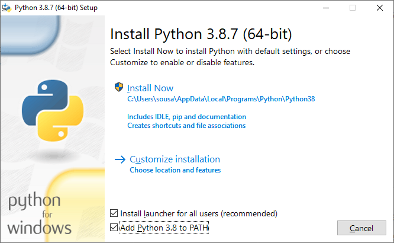
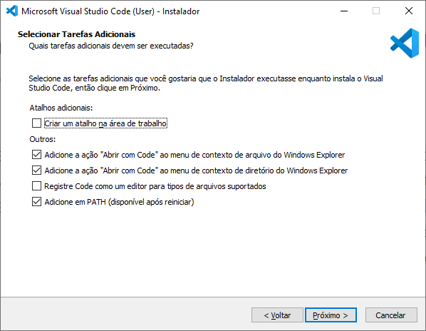

# Configuração do Ambiente

Nesse documento, você encontrará as instruções necessárias para configurar o ambiente Python necessário para o desenvolvimento do projeto.

## Instalação do Python

### Windows

Para instalar o Python no Windows, basta acessar o [site oficial](https://www.python.org/downloads/windows/) e baixar o instalador.

Lembre-se de executar o instalador como administrador e marcar a opção "Adicionar Python 3.x ao PATH".

Para verificar se a instalação foi bem sucedida, abra o terminal e execute o comando `python --version`. O resultado deve ser a versão do Python instalada.

### Linux

No Linux, o Python já vem instalado por padrão. Para verificar a versão instalada, abra o terminal e execute o comando `python --version`. O resultado deve ser a versão do Python instalada. Apenas certifique-se de que a versão instalada é igual ou superior à versão 3.6.

Caso esteja utilizando o Ubuntu, você precisa instalar o pacote `python3-venv` para criar ambientes virtuais. Para isso, execute o comando `sudo apt install python3-venv`.

### macOS

No macOS, o Python já vem instalado por padrão. Para verificar a versão instalada, abra o terminal e execute o comando `python --version`. O resultado deve ser a versão do Python instalada. Apenas certifique-se de que a versão instalada é igual ou superior à versão 3.6.

## Instalação do VSCode

### Windows

Para instalar o VSCode no Windows, basta acessar o [site oficial](https://code.visualstudio.com/download) e baixar o instalador.

Lembre-se de executar o instalador como administrador e marcar a opção "Adicione em PATH (disponível apos reiniciar)".

### Linux

Para instalar o VSCode no Linux, basta acessar o [site oficial](https://code.visualstudio.com/download) e baixar o instalador para Linux. Ou execute o comando `sudo snap install --classic code` no terminal.

### macOS

Para instalar o VSCode no macOS, basta acessar o [site oficial](https://code.visualstudio.com/download) e baixar o instalador. Aqui basta seguir o assistente de instalação.

## Configuração do VSCode

É recomendado que você instale as seguintes extensões no VSCode:

- [Python](https://marketplace.visualstudio.com/items?itemName=ms-python.python): Essa extensão é necessária para o VSCode reconhecer o Python e fornecer recursos como auto-completar, linting, debug, etc.
- [Django](https://marketplace.visualstudio.com/items?itemName=batisteo.vscode-django): Essa extensão é necessária para o VSCode adicionar snippets e syntax highlighting para arquivos de template do Django.
